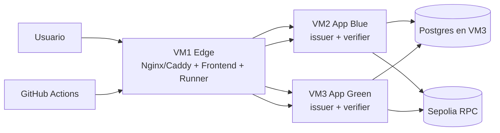

# Propuesta de Despliegue SSI v2 en 3 VMs (Simple y Efectiva)

## 1) Contexto y restricciones (Virtech)

Basado en la documentación de `serveistic-documentacio-us-nuvol-privat-servei-virtech.pdf`:

- Las VMs se crean/gestionan desde portal web (autoservicio).
- Acceso por VPN UPC o por NAT de puertos (según plantilla elegida).
- No hay backup gestionado por plataforma.
- Si se pierde acceso a una VM, normalmente hay que destruir y recrear.
- Ubuntu como base de las VMs.

Implicación práctica:

- Debemos diseñar para "recreación rápida" (infra reproducible).
- Debemos automatizar despliegue y rollback a nivel aplicación.
- Debemos montar nuestras propias copias de seguridad.

---

## 2) Objetivos de esta propuesta

- Separación clara de responsabilidades en 3 VMs.
- Despliegue y rollback fáciles (sin Kubernetes).
- CI/CD real de despliegue.
- Operación intuitiva para equipo pequeño.
- Mantener complejidad baja.

---

## 3) Decisión de arquitectura

### Decisión principal

Usar:

- **Docker Compose** por VM (simple y suficiente).
- **Ansible** como orquestador de despliegue (idempotente y reversible).
- **GitHub Actions** para CI/CD (más simple que mantener Jenkins en 3 VMs).
- **Nginx/Caddy** en VM Edge como reverse proxy y switch de tráfico.

### Por qué no Terraform en fase 1

Con la información actual de Virtech (portal web y sin API de IaC confirmada), Terraform puede no aportar valor inmediato para provisión. Se deja como **fase opcional** si confirmamos API OpenStack/compatible.

---

## 4) Reparto de las 3 VMs

- **VM1 - Edge + Control**
  - Reverse proxy (Nginx o Caddy).
  - Frontend estático (portal/admin/holder).
  - Self-hosted runner de GitHub Actions (solo despliegue).
  - Certificados TLS (Let's Encrypt o CA interna).

- **VM2 - App Blue**
  - `issuer` + `verifier` (contenedores).
  - Runtime app (sin estado local crítico).

- **VM3 - App Green + Data**
  - `issuer` + `verifier` candidatos (contenedores).
  - Postgres (estado persistente) + backups programados.

Nota:

- El estado blockchain se consulta en Sepolia (no hace falta nodo local en producción).
- La app debe dejar de depender de SQLite para producción final.

---

## 5) Diagrama visual (alto nivel)

---

## 6) Modelo de despliegue y rollback

### Estrategia

Blue/Green a nivel de aplicación:

1. Tráfico actual en Blue.
2. Desplegar nueva versión en Green.
3. Ejecutar smoke tests (`/health`, emisión, verificación).
4. Si OK, switch de proxy Blue -> Green.
5. Si falla, rollback inmediato Green -> Blue.

### Revocación rápida

- Revocación operativa: cambiar upstream en proxy (segundos).
- Revocación de release: tag anterior + redeploy Ansible.
- Revocación de infraestructura: recrear VM afectada y reaplicar playbook.

---

## 7) CI/CD propuesto

### CI (cada PR)

- `pytest` completo.
- Lint básico Python/JS.
- Build de imágenes Docker.
- Validación de seguridad mínima (dependencias vulnerables críticas).

### CD (main)

- Job con aprobación manual.
- Deploy en Green (Ansible).
- Smoke tests automáticos.
- Switch de tráfico en VM1.
- Notificación de estado.

### Artefactos

- Imágenes versionadas por tag SHA.
- Inventario Ansible por entorno.
- Registro de release y rollback.

---

## 8) Seguridad mínima obligatoria

- SSH solo con clave, sin password.
- `ufw` con puertos explícitos por VM.
- Secrets en `.env` fuera de git y gestionados por Ansible Vault.
- CORS restrictivo por dominio.
- Frontend admin protegido por IP/VPN o auth adicional.
- Backups cifrados de Postgres + prueba de restauración.

---

## 9) Checklist antes de ir a producción

- Migración SQLite -> Postgres aplicada y probada.
- Variables de entorno separadas por entorno.
- Health checks funcionales (`issuer` y `verifier`).
- Split frontend validado (`portal`, `admin`, `holder`).
- Prueba de rollback ejecutada al menos una vez.
- Backup/restore documentado y testado.
- Runbook operativo de incidencias listo.

---

## 10) Plan de ejecución (propuesto)

### Fase A (1-2 días)

- Estandarizar contenedores y compose por servicio.
- Preparar Ansible base (usuarios, hardening, runtime Docker).

### Fase B (1-2 días)

- Despliegue Blue/Green + proxy switch.
- Pipeline CI/CD en GitHub Actions.

### Fase C (1 día)

- Migración de datos a Postgres.
- Backups + smoke tests + rollback drill.

---

## 11) Resultado esperado

Un sistema:

- simple de operar,
- bien separado en 3 VMs,
- con despliegue/rollback en minutos,
- reproducible si hay que destruir/recrear máquinas en Virtech.
