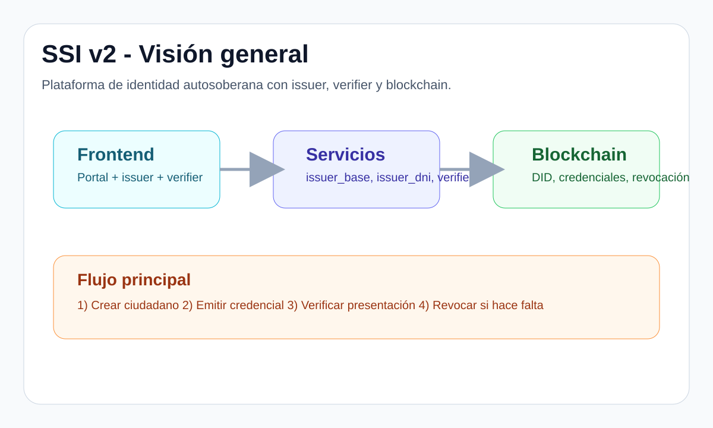
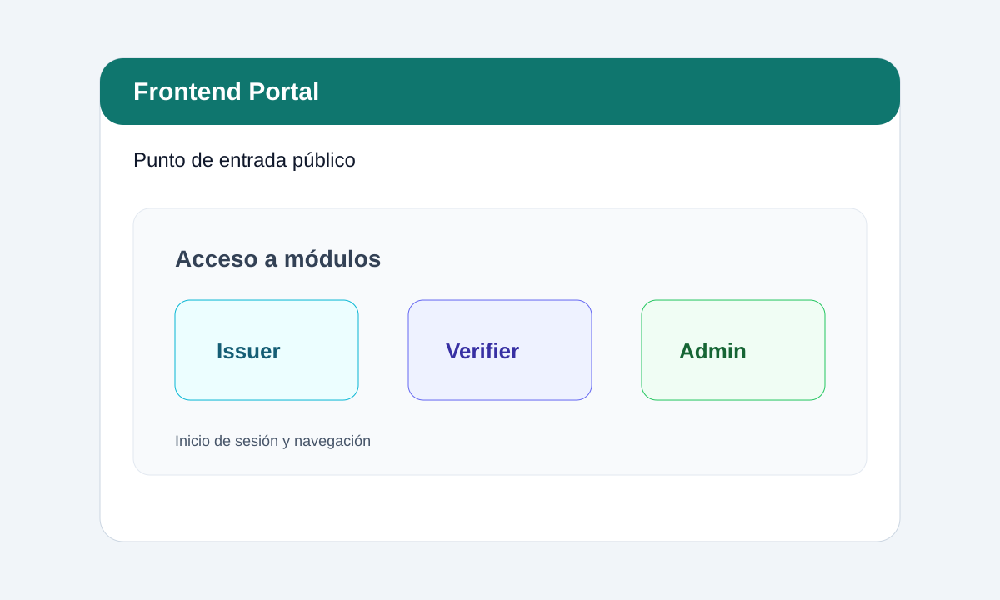
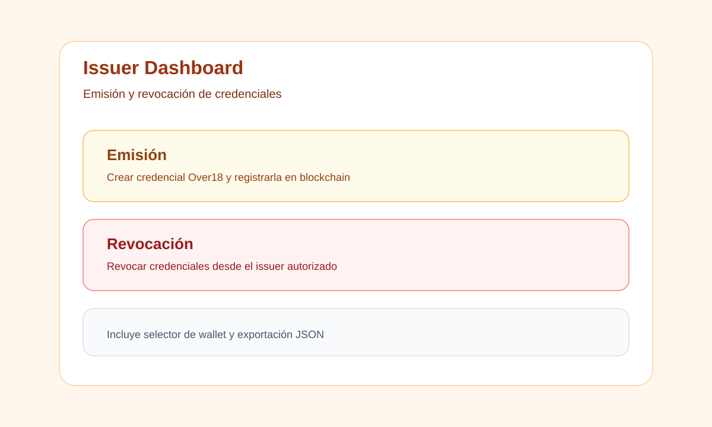
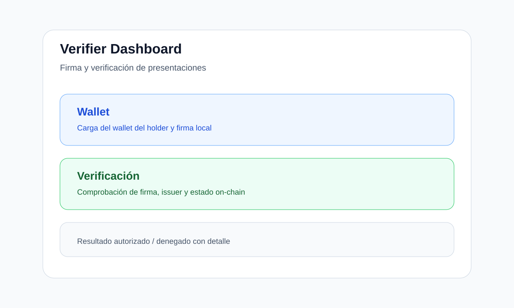

# SSI v2 - Memoria de entrega

Este directorio recoge la documentación final del proyecto para la entrega académica.
Incluye una explicación amplia del sistema, de sus carpetas, de su funcionamiento y de cómo ejecutarlo.
No contiene código fuente del proyecto.

## 1. Resumen ejecutivo

SSI v2 es una plataforma de identidad autosoberana orientada a la emisión y verificación de credenciales verificables (W3C Verifiable Credentials) con apoyo de blockchain.

El sistema permite:
- registrar ciudadanos en un issuer específico para DNI,
- emitir credenciales con información de mayoría de edad,
- guardar el estado de emisión y revocación en blockchain,
- firmar credenciales con la clave del emisor,
- verificar presentaciones desde un panel de verificación,
- desplegarse tanto en local como en VMs o en testnet.

Portal público de demostración:
- http://nattech.fib.upc.edu:40560/frontend_portal.html

## 2. Objetivo del proyecto

El objetivo es disponer de un flujo SSI completo y entendible por partes:
- un portal de entrada sencillo para abrir el sistema,
- una capa de servicios reutilizable para emisores,
- un emisor especializado para el caso DNI/Over18,
- un verificador que comprueba firma, emisor y estado on-chain,
- una infraestructura de despliegue reproducible.

La idea principal del proyecto es separar la lógica general de SSI de la lógica concreta del caso de uso DNI, para poder extender el sistema en el futuro con nuevas credenciales sin rehacer la base.

## 3. Arquitectura general

La arquitectura está dividida en cuatro capas:

### 3.1 Frontend
Interfaz web para usuarios, emisores y verificadores.

Componentes principales:
- `frontend/frontend_portal.html`: portal de entrada.
- `frontend/issuer_dashboard.html`: panel de emisión y revocación.
- `frontend/verifier_dashboard.html`: panel de verificación.
- `frontend/frontend_server.py`: servidor ligero para servir los HTML.

### 3.2 Backend
Servicios FastAPI separados por responsabilidad.

Componentes principales:
- `services/issuer_base/`: lógica común del issuer.
- `services/issuer_dni/`: reglas específicas del DNI.
- `services/verifier/`: validación de presentaciones y estado.

### 3.3 Capa compartida
Funciones y configuración reutilizadas por todos los servicios.

Componentes principales:
- `shared/blockchain_client.py`: acceso a Web3 y al contrato.
- `shared/settings.py`: lectura centralizada de configuración.

### 3.4 Blockchain y despliegue
Contratos, bootstrap y scripts para levantar o desplegar la infraestructura.

Componentes principales:
- `blockchain/`: contrato, scripts y artefactos.
- `scripts/`: arranque, setup, despliegue y parada.
- `deployments/`: wallets, ABI y contratos generados.

## 4. Flujo funcional

El flujo completo del sistema es el siguiente:

1. Un administrador crea un ciudadano DNI en el backend.
2. El issuer genera la credencial `Over18Credential`.
3. La credencial se firma con la clave del issuer.
4. Se registra el estado en blockchain.
5. El titular guarda su wallet o lo carga desde el frontend.
6. El verificador recibe la presentación y valida:
	- la firma,
	- la identidad del emisor,
	- el estado on-chain,
	- la validez de la credencial.

En el caso de menores, la emisión sigue permitiéndose, pero la credencial queda marcada con `isOver18 = false` y el rechazo se produce en la verificación.

## 5. Explicación de carpetas y archivos

### 5.1 Raíz del proyecto
- `README.md`: guía general del proyecto.
- `readme_entrega/README.md`: memoria de entrega que estás leyendo ahora.
- `FINAL_STATUS.md`: resumen del estado final del trabajo.
- `PRODUCTION_CHECKLIST.md`: lista de comprobación para despliegue.

### 5.2 `frontend/`
Carpeta con la interfaz web del sistema.

- `frontend_portal.html`: punto de entrada visual y navegación a los módulos.
- `issuer_dashboard.html`: panel para emitir y revocar credenciales.
- `verifier_dashboard.html`: panel para firmar y verificar presentaciones.
- `frontend_server.py`: servidor HTTP simple para servir los HTML en local.
- `frontend.variables.js`: variables generadas automáticamente con URLs y configuración.

### 5.3 `services/issuer_base/`
Base común para cualquier emisor.

- `app.py`: creación de la app principal del issuer.
- `routes/credentials.py`: emisión genérica, revocación y builders de credenciales.
- `routes/admin.py`: administración de ciudadanos y acciones de control.
- `routes/health.py`: comprobación de estado.
- `services/auth.py`: autenticación y autorización.
- `services/database.py`: acceso a base de datos y sesiones.

### 5.4 `services/issuer_dni/`
Extensión concreta para el caso de uso del DNI.

- `app.py`: ensambla la app del issuer DNI.
- `routes.py`: rutas específicas del DNI y lógica `Over18Credential`.
- `validators.py`: validación del formato y checksum del DNI, y cálculo de edad.
- `models.py`: modelo de la base de datos para ciudadanos DNI.

### 5.5 `services/verifier/`
Servicio encargado de la verificación.

- `app.py`: API principal del verificador.
- Rutas y validaciones para comprobar credenciales, emisores autorizados y revocación.

### 5.6 `shared/`
Código compartido por varios servicios.

- `blockchain_client.py`: cliente Web3, hashing canónico, transacciones y consultas on-chain.
- `settings.py`: configuración del sistema desde entorno y archivos.

### 5.7 `scripts/`
Automatización de arranque, preparación y despliegue.

- `setup_complete.py`: configura el entorno completo.
- `setup_issuer.py`: genera o prepara la wallet del issuer.
- `generar_did.py`: genera la identidad del holder.
- `seed_db.py`: carga datos iniciales.
- `start_all.py`: arranca la pila completa local.
- `deploy_vms.sh`: despliega en VMs.
- `teardown.sh`: apaga y limpia servicios locales.

### 5.8 `blockchain/`
Infraestructura de contratos y scripts blockchain.

- contratos Solidity y scripts Hardhat,
- despliegue local,
- despliegue en testnet,
- bootstrap del issuer,
- utilidades de validación.

### 5.9 `config/`
Configuración general del proyecto.

- dependencias Python,
- ejemplos de `.env`,
- configuración para despliegue en VMs,
- variables de red y puertos.

### 5.10 `deployments/`
Artefactos generados durante el despliegue.

- wallets de issuer y holder,
- contratos desplegados,
- ABI y metadatos de red.

### 5.11 `tests/`
Suite automatizada que valida el comportamiento del sistema.

- pruebas del issuer,
- pruebas del verificador,
- pruebas del cliente blockchain,
- pruebas de frontend.

## 6. Detalle de los componentes principales

### 6.1 Portal de entrada
El portal de entrada sirve para orientar al usuario hacia los módulos disponibles.
Es la página pensada para acceder rápidamente al entorno de SSI sin exponer la complejidad técnica.

### 6.2 Panel de issuer
El issuer permite:
- cargar o generar la identidad del emisor,
- emitir una credencial verificable,
- almacenar el hash y el estado en blockchain,
- revocar credenciales cuando sea necesario.

### 6.3 Panel de verifier
El verificador permite:
- cargar la wallet del holder,
- cargar una credencial,
- firmar una presentación,
- enviar la VP al backend,
- recibir un resultado de acceso autorizado o denegado.

### 6.4 Lógica DNI
El issuer DNI incorpora reglas concretas del caso de uso:
- validación de formato DNI,
- validación de letra de control,
- cálculo de edad,
- emisión de credenciales Over18,
- integración con blockchain para registrar el estado.

### 6.5 Blockchain client
El cliente blockchain centraliza:
- conversiones DID a direcciones,
- hashing canónico de credenciales,
- envío de transacciones,
- consulta del estado de credenciales,
- consultas de salud del nodo.

## 7. Cómo ejecutar el proyecto en local

### 7.1 Preparación inicial
```bash
python3 -m venv .venv
source .venv/bin/activate
pip install -r config/requirements.txt
python3 scripts/setup_complete.py
```

### 7.2 Arranque
```bash
python3 scripts/start_all.py
```

### 7.3 Accesos útiles
- Portal local: `http://127.0.0.1:8080/frontend_login.html`
- Portal público: `http://nattech.fib.upc.edu:40560/frontend_portal.html`

### 7.4 Parada
```bash
bash scripts/teardown.sh local
```

## 8. Despliegue y entornos

### 8.1 Entorno local
Pensado para desarrollo rápido, pruebas y demos.
Se usa normalmente con SQLite y contratos locales.

### 8.2 Entorno de VMs
Usado para una versión más cercana a producción.
Incluye separación de frontend, backend y blockchain, con scripts de despliegue dedicados.

### 8.3 Testnet
El proyecto soporta despliegue en Sepolia cuando se configuran correctamente:
- RPC,
- wallet del deployer,
- dirección del contrato,
- credenciales de red.

## 9. Pruebas y validación

La suite de tests automatizados verifica:
- creación de ciudadanos,
- emisión de credenciales,
- verificación de presentaciones,
- revocación,
- integración con blockchain simulada,
- comportamiento de frontend esperado.

Comando de validación:
```bash
PYTEST_DISABLE_PLUGIN_AUTOLOAD=1 python3 -m pytest -q
```

Resultado observado en este proyecto:
- 27 tests pasando.

## 10. Imágenes incluidas

Las imágenes están integradas dentro de `readme_entrega/images/` y sirven para dar una visión rápida del sistema.

### 10.1 Visión general


### 10.2 Portal frontal


### 10.3 Panel de issuer


### 10.4 Panel de verifier


## 11. Qué se entrega exactamente

La carpeta `readme_entrega/` está pensada como paquete final de entrega.
Contiene:
- este README ampliado,
- imágenes SVG integradas,
- documentación descriptiva del proyecto,
- resumen de uso y arquitectura.

No contiene código fuente del sistema.

## 12. Cómo empaquetarlo

Si necesitas generar el ZIP para subirlo al repositorio de entrega:
```bash
zip -r readme_entrega.zip readme_entrega/
```

## 13. Puntos clave para evaluación

- Arquitectura modular y separada por responsabilidades.
- Emisión y verificación con credenciales verificables.
- Integración blockchain para hash, estado y revocación.
- Paneles web sencillos para el flujo completo.
- Documentación centralizada y lista para entrega.

## 14. Cierre

Este documento resume el proyecto con suficiente detalle para evaluación académica y para comprensión rápida del funcionamiento.
Si hace falta una versión aún más formal, con portada, índice numerado o texto adaptado a memoria académica, se puede preparar a partir de esta base.
